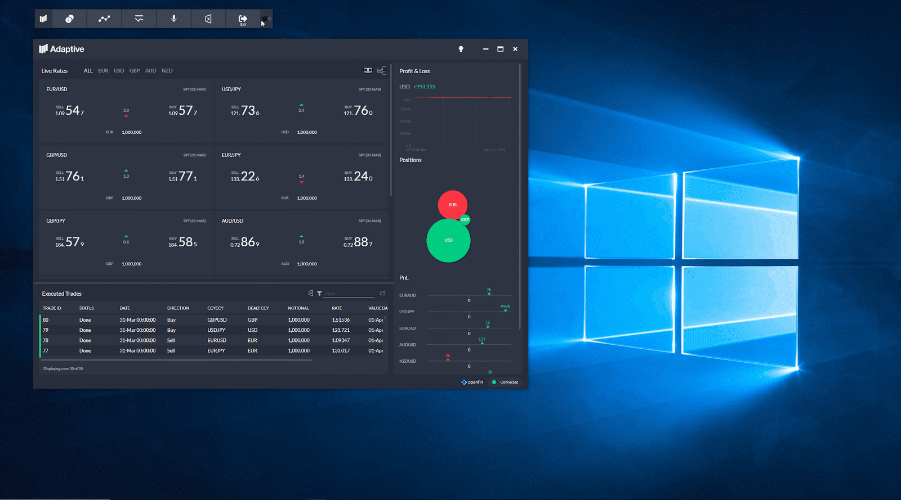

[](https://github.com/AdaptiveConsulting/ReactiveTraderCloud/actions?query=workflow%3ACI)
[](https://github.com/AdaptiveConsulting/ReactiveTraderCloud/releases/latest)
[](https://opensource.org/licenses/Apache-2.0)

[](http://weareadaptive.com/)

# Reactive Trader®

Reactive Trader® is a real-time FX trading platform designed to showcase reactive programming principles across the full application stack.

Originally [written in WPF and .Net](https://github.com/AdaptiveConsulting/ReactiveTrader), and now in React, React-RxJS, Node.js and running on [Hyrda](https://weareadaptive.com/platform-solutions/), we continue to evolve the platform to use the latest technologies.

Please see [our Showcase page](https://weareadaptive.com/showcase/) for a full list of the latest features.



## Demo

- [Web & Mobile]
- [OpenFin] installer: [Windows][openfin-win], [Mac][openfin-mac]
- [Finsemble] smart desktop installer: [Windows][finsemble-win]
- [Style guide]: Colours, iconography, typography, atoms and molecules
- [Storybook]: Explore individual React components

[Web & Mobile]: https://www.reactivetrader.com
[Openfin]: https://openfin.co/
[Finsemble]: https://cosaic.io/finsemble/
[Storybook]: https://www.reactivetrader.com/storybook
[Style guide]: https://www.reactivetrader.com/styleguide
[openfin-win]: ./src/client/install/Reactive-Launcher-Demo.exe?raw=true
[openfin-mac]: ./src/client/install/Reactive-Launcher-Demo.dmg?raw=true
[finsemble-win]: https://storage.googleapis.com/reactive-trader-finsemble/pkg/ReactiveTraderFinsemble.exe

## Development

<details open>
<summary>Web client</summary>

1. Fork and clone the ReactiveTraderCloud repo ([see Contributing page](CONTRIBUTING.md))

2. Install [Node.js and npm](https://nodejs.org/en/download/)

3. Start the client:
   ```bash
    cd src/client
    npm install
    npm start
    ```
   This will connect to the dev back-end in the cloud.

4. Navigate to http://localhost:1917
</details>


## CI/CD

We practice continuous integration and deployment. Every branch and pull request triggers a build and deployment to an ephemeral environment. Merging to master causes a build and deployment to our [development environment](https://web.dev.reactivetrader.com).

## Contributing

Please see our [contribution guidelines](./CONTRIBUTING.md).

## Who are we?

Reactive Trader was written by the team at [Adaptive](http://weareadaptive.com/), a consultancy that specialises in building real-time trading systems.

Please [contact us](https://weareadaptive.com/contact/) if you'd like to learn more, or follow us via our [blog](https://weareadaptive.com/category/blog/), [Twitter](https://twitter.com/WeAreAdaptive), or [LinkedIn](https://www.linkedin.com/company/adaptive-consulting-ltd/).

## License

This application is made available under the [Apache license v2.0](./LICENSE).
