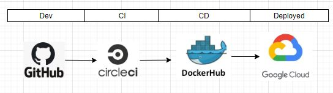

[](https://github.com/AdaptiveConsulting/ReactiveTraderCloud/actions?query=workflow%3ACI)
[](https://github.com/AdaptiveConsulting/ReactiveTraderCloud/releases/latest)
[](https://opensource.org/licenses/Apache-2.0)

[](http://weareadaptive.com/)

# Reactive Trader

Reactive Trader is a real-time FX trading platform designed to showcase reactive programming principles across the full application stack.

Originally [written in WPF and .Net](https://github.com/AdaptiveConsulting/ReactiveTrader), and now in React/Redux, .Net and Node.js, we continue to evolve the platform to use the latest technologies.

Please see [our Showcases page](https://weareadaptive.com/showcase/) for a full list of the latest features.


## Demo

- [Web & Mobile]
- [OpenFin OS] installer: [Windows][openfin-win], [Mac][openfin-mac]
- [Finsemble] smart desktop installer: [Windows][finsemble-win]
- [Style guide]: Colours, iconography, typography, atoms and molecules
- [Storybook]: Explore individual React components

[Web & Mobile]: https://web-demo.adaptivecluster.com
[Openfin OS]: https://openfin.co/
[Finsemble]: https://www.chartiq.com/finsemble
[Storybook]: https://web-demo.adaptivecluster.com/storybook
[Style guide]: https://web-demo.adaptivecluster.com/styleguide
[openfin-win]: https://install.openfin.co/download/?fileName=Reactive-Launcher-Demo&config=https://web-demo.adaptivecluster.com/openfin/launcher.json
[openfin-mac]: https://install.openfin.co/download/?os=osx&fileName=Reactive-Launcher-Demo&config=http://web-demo.adaptivecluster.com/openfin/launcher.json&internal=true&iconFile=https://web-demo.adaptivecluster.com/static/media/adaptive-icon-256x256.png&appName=Reactive%20Launcher
[finsemble-win]: https://storage.googleapis.com/reactive-trader-finsemble/pkg/ReactiveTraderFinsembleSetup.exe

## Installation

<details>
<summary>With Docker</summary>

1. Install Docker ([from the Docker website](https://www.docker.com/get-started))
2. Fork and clone the ReactiveTraderCloud repo ([see Contributing page](CONTRIBUTING.md))
3. From the src folder run: `docker-compose up`
4. Open a browser and navigate to http://localhost to see the application running
5. To shutdown the application run: `docker-compose down`
   </details>

<details>
<summary>With Docker and Kubernetes</summary>

1. Follow the steps to run with Docker
2. From the src directory run `docker-compose build`
3. Set the environment variables:
   ```bash
   export DOCKER_USER=localuser
   export BUILD_VERSION=0.0.0
   ```
4. Run the following command:
   ```bash
   docker stack deploy --orchestrator kubernetes --compose-file ./docker-compose.yml rtcstack
   ```
5. To see your services and pods running, run:
   ```bash
   kubectl get services
   kubectl get pods
   ```
6. Open a browser and navigate to http://localhost to see the application running

7. To shutdown / remove stack, run: `kubectl delete stack rtcstack`
   </details>

<details>
<summary>Without Docker (for development/debugging)</summary>

1. Fork and clone the ReactiveTraderCloud repo ([see Contributing page](CONTRIBUTING.md))

2. Install dependencies & add them to your path:

- [Node.js and npm](https://nodejs.org/en/download/)
- [.Net Core SDK](https://dotnet.microsoft.com/download)
- [Event Store](https://eventstore.com/downloads/)
- [RabbitMQ](https://www.rabbitmq.com/download.html)

3. Enable RabbitMQ Web Stomp Pluggin

   ```bash
   rabbitmq-plugins enable rabbitmq_web_stomp
   ```

4. Populate Event Store:

   ```bash
   cd src/server/dotNet
   dotnet run -p Adaptive.ReactiveTrader.Server.Launcher --populate-eventstore
   ```

5. Start the .NET services:

   ```bash
   cd src/server/dotNet
   dotnet run -p Adaptive.ReactiveTrader.Server.Launcher all
   ```

   To run individual services, `cd` into their folder, and type `dotnet run`.

6. (Optional) Start Node services by running `npm run start:dev` from their respective folders, e.g.:

   ```bash
   cd src/server/node/priceHistory
   npm install
   npm run start:dev
   ```

7. Start the client against the local server components:

   ```bash
   cd src/client
   npm install
   npm run start:local-backend
   ```

8. Alternative commands:

- `npm run build:demo-backend` - to run the client against a demo backend running in the cloud
- `npm run test` - to run tests using Jest
  </details>

## CI/CD

We practice continuous integration and deployment. Every merge to master causes a build and deployment to our [development environment](https://web-dev.adaptivecluster.com) to occur as follows:



## Contributing

Please see our [contrubtion guidelines](./CONTRIBUTING.md).

## Who are we?

Reactive Trader was written by the team at [Adaptive](http://weareadaptive.com/), a consultancy that specialises in building real-time trading systems.

Please [contact us](https://weareadaptive.com/contact/) if you'd like to learn more, or follow us via our [blog](https://weareadaptive.com/category/blog/), [Twitter](https://twitter.com/WeAreAdaptive), or [LinkedIn](https://www.linkedin.com/company/adaptive-consulting-ltd/).

## License

This application is made available under the [Apache license v2.0](./LICENSE).
