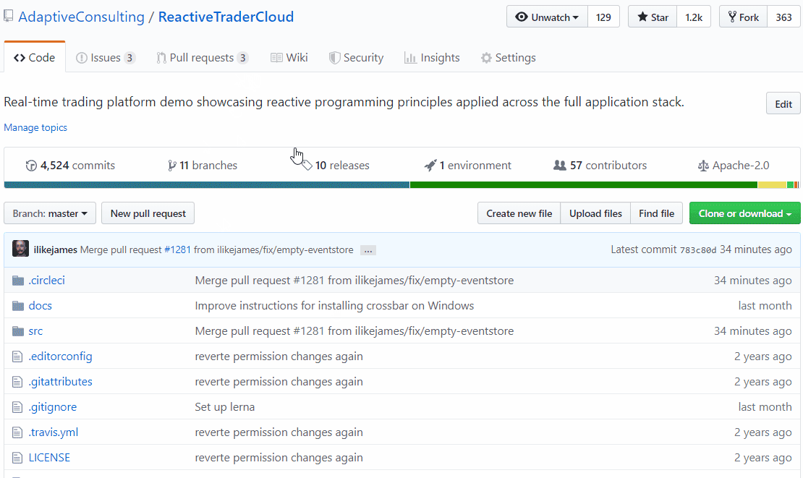
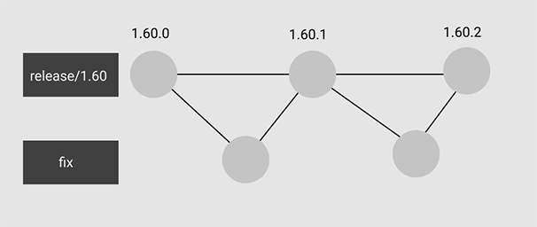

# Reactive Trader Cloud [](https://circleci.com/gh/AdaptiveConsulting/ReactiveTraderCloud/tree/develop)

## Overview

[](http://weareadaptive.com/)

Reactive Trader Cloud is a real-time FX trading platform demo showcasing reactive programming principles applied across the full application stack.

All frameworks and libraries used are entirely open source, and each component can be run on either Windows, Linux or Mac OS X.

The services are distributed and can be recovered from disconnections - this is similar to the approach that major financial institutions use for trading systems.


### Live demo
For a live demo, see [web-demo.adaptivecluster.com/](https://web-demo.adaptivecluster.com/)

### Live demo in OpenFin
For live demo in OpenFin download [Reactive Trader App](src/client/install)

### Reactive Trader Excel
You can use Reactive Trader Excel in integration with Reactive Trader, you can find the instructions for setting it up [here](docs/setup/reactive-trader-excel.md)

## Architecture

The backend is made up of distributed services written in .NET using the cross-platform capabilities provided by [.NET Core](https://dotnet.github.io).

You can deploy server components via Docker containers. This means you can manage clusters using tools such as [Kubernetes](http://kubernetes.io/) for better resiliency and ease of deployment.

Client-side implementations are available for all major platforms, including desktop and mobile browser as well as OpenFin.


### Front end

The front end is written with Typescript, React, Redux and Styled components. For more details on the client-side infrastructure, see [here](docs/client.md).

### Back end

The back-end services are cross-platform. For more details on the back-end infrastructure, see [here](docs/server.md).

## Getting started
You can go to the [How to](docs/deployment/readme.md) page to follow build and deployment

## Talks and podcasts

+ [Reactive, Event Driven User Interfaces](https://vimeo.com/113716036) by Ray Booysen at NDC London 2014
+ [Event Driven User Interfaces](https://youtu.be/Tp5mRlHwZ7M) by Lee Campbell & Matt Barrett at React London 2014
+ [It's all messages now; where are my abstractions?](http://www.codesleuth.co.uk/notes/ndcoslo2015/Its-all-messages-now;-where-are-my-absractions.html) by Matt Barrett at NDC Oslo 2015
+ [The Hanselminutes: Creating Reactive User Interfaces](http://hanselminutes.com/428/creating-reactive-user-interfaces-with-adaptive-consultings-reactive-trader) with Matt Barrett
+ [Full-stack ReactiveX](http://dotnetrocks.com/?show=1333) with Qiming Liu on .NET Rocks!
+ [Developing Modern Applications in .NET core with Docker and Kubernetes](https://www.youtube.com/watch?v=70hcZO3zpnc) with Qiming Liu and James Watson

## Blog posts

To read about aspects of Reactive Trader in greater depth, check out the following blogs:
+ [Asynchrony and concurrency](http://weareadaptive.com/blog/2014/04/18/asynchrony-concurrency/) in which we discuss embracing asynchrony and concurrency at all levels of your application.
+ [Everything is a stream](http://weareadaptive.com/blog/2014/05/05/everything-is-a-stream/), in which we point out that all service calls from Reactive Trader result in streams of responses, not just a single response - and why this is so powerful.
+ [System health & failures](http://weareadaptive.com/blog/2014/06/16/system-health-failures/), in which we dig more into models of system health so you can easily respond to failures in your application, and how to use heart beating to detect component failure.
+ [John's series of blog posts on web messaging and abstractions](http://weareadaptive.com/blog/2015/06/15/series-of-blog-posts/)

## Who are we?

Reactive Trader was written by the team at [Adaptive](http://weareadaptive.com/), a consultancy that specialises in building real-time trading systems. We have many years of experience in building trading systems for clients with highly demanding latency and reliability requirements. Over the years we have learnt quite a few lessons, and wanted to talk about and point to examples of how we solve technical problems related to real-time delivery of messages.

## Deployment

We practice _continous delivery_. Every merge to master triggers a build and publishing of the application's images.
The commit will be tagged with the latest semver version (master by default is a new minor version), the published
docker images will be similarly tagged with the same version, and there will  be a version number published in
the application's UI. The new version will be automatically deployed to the [`dev`](https://web-dev.adaptivecluster.com/) environment.


To get a version into another environment, tag the version with `env-<environment_name>` e.g. for `env-demo`:

```bash
git tag -a env-demo -m "Deployed 1.60.0" 1.60.0

# Note: If the tag already exists, it will have to be deleted first before re-tagging

# delete local tag:
git tag -d env-demo
# delete remote tag:
git push origin :env-demo
```

This can also be done using the github UI.




### Patching

There are times when an existing version will need a bug fix.
A new branch should be taken from the version to patch:

```bash
git checkout -b release/1.60 1.60.0
git push origin release/1.60
```

Then your fix PR should target this `release/1.60` branch.
Merges will build a new semver patch versions e.g.`1.60.1`, `1.60.2`, etc.



IF the bug also exists in another environment, it will be expected that either more PRs should be raised to other environments (and master), `cherry-pick`ing the fix commit. Or, if there has been little code change, it may be possible to merge the `release/1.60` branch into master, but be careful with this approach.

Patches are not automatically deployed at this stage, so this will have to be done by manually creating the `env-<environment_name>` tag.

