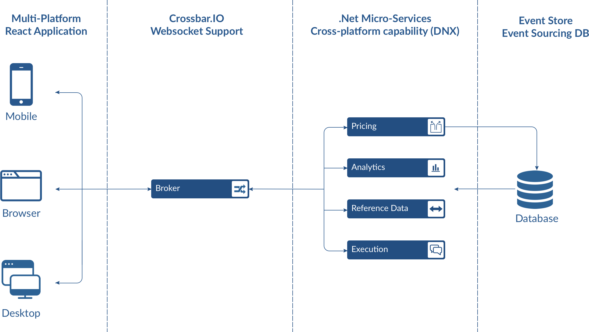

# Reactive Trader Cloud

## Overview

Reactive Trader Cloud is a real-time FX trading platform demo showcasing reactive programming principles applied across the full application stack.

Improvements have been made across the board since [Reactive Trader v1](https://github.com/AdaptiveConsulting/ReactiveTrader). The UI is revamped with a modern Javascript framework (React), and an event sourcing approach is used by the backend services for data resiliency.

All frameworks and libraries used are entirely open source, and each component can be run on either Windows, Linux or Mac OS X.

The services are distributed and are capable of recovery from disconnections. This demonstrates a similar approach to what is put into practice in major financial institutions for trading systems.

### Live Demo
A live demo can be found at [web-demo.adaptivecluster.com/](http://web-demo.adaptivecluster.com/)

## Architecture

The backend is made up of distributed services written in .NET leveraging the cross-platform capabilities provided by [DNX](https://github.com/aspnet/dnx).

Every server component can be deployed via Docker containers. This allows the use of tools such as [Kubernetes](http://kubernetes.io/) to facilitate cluster management for resiliency purposes as well as ease of deployment.

Client-side implementations are available for all major platforms, including desktop browser, OpenFin, Android, iOS, Apple Watch and WPF.

### Front-End

The front-end is written in Javascript with React.  More details on the client-side infrastructure are available [here](docs/client.md).

### Back-End

The back-end services are cross-platform. More details on the back-end infrastructure are available [here](docs/server.md).

## Getting Started

You will find a guide to setup ReactiveTraderCloud for your platform [here](docs/setup/getting-started.md).

## Concepts

Those topics will be covered in the upcoming weeks.

+ [vNext Client Architecture with ES.next, React, Webpack, RxJs](docs/articles/vNextClientArchitecture.md)
+ [Cross Platform .Net Development with the dotnet CLI tool](docs/articles/dotnet.md)
+ [Event Sourcing](docs/articles/eventSourcing.md)
+ [Web Messaging with WAMP & Crossbar](docs/articles/webMessaging.md)
+ [Always Connected Apps in a Microservice Environment](docs/articles/alwaysConnectedApps.md)
+ [Desktop Client Support with OpenFin](docs/articles/desktopClientWithOpenFin.md)
+ [Failover and Resiliency in a Microservice Environment](docs/articles/failOverAndResiliency.md)
+ [Deployment with Containers](docs/articles/deploymentWithContainers.md)

## Talks and Podcasts

+ [Reactive, Event Driven User Interfaces](https://vimeo.com/113716036) by Ray Booysen at NDC London 2014
+ [Event Driven User Interfaces](https://youtu.be/Tp5mRlHwZ7M) by Lee Campbell & Matt Barrett at React London 2014
+ [It's all messages now; where are my abstractions?](http://www.codesleuth.co.uk/notes/ndcoslo2015/Its-all-messages-now;-where-are-my-absractions.html) by Matt Barrett at NDC Oslo 2015
+ [The Hanselminutes: Creating Reactive User Interfaces](http://hanselminutes.com/428/creating-reactive-user-interfaces-with-adaptive-consultings-reactive-trader) with Matt Barrett

## Blog posts

We have written a number of blog posts in which we dive deeper into certain aspects of Reactive Trader.
+ [Asynchrony and concurrency](http://weareadaptive.com/blog/2014/04/18/asynchrony-concurrency/) in which we discuss embracing asynchrony and concurrency at all levels of your application.
+ [Everything is a stream](http://weareadaptive.com/blog/2014/05/05/everything-is-a-stream/), in which we point out that all service calls from Reactive Trader result in streams of responses, not just a single response - and why this is so powerful.
+ [System health & failures](http://weareadaptive.com/blog/2014/06/16/system-health-failures/), in which we dig more into models of system health so you can easily respond to failures in your application, and how to use heart beating to detect component failure.
+ [John's series of blog posts on web messaging and abstractions](http://weareadaptive.com/blog/2015/06/15/series-of-blog-posts/)

## Who Are We?

Reactive Trader was written by the team at [Adaptive](http://weareadaptive.com/), a consultancy that specialises in building real time trading systems. We have many years of experience in building trading systems for clients with highly demanding latency and reliability requirements. Over the years we have learnt quite a few lessons, and wanted to talk about and point to examples of how we solve technical problems related to real time delivery of messages.

