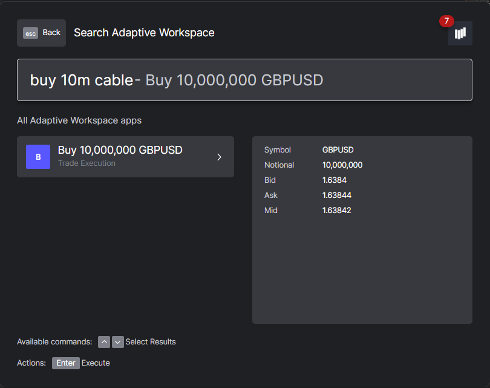

# Openfin Workspace



The Reactive Trader Openfin Workspace Provider is a standalone application that registers a platform provider with Openfin. It is built separately to the Reactive Trader client, and deployed to the Openfin bucket in Google Cloud Storage (under the subfolder/workspace)

The manifest file is available at - `http://openfin.dev|uat|prod.reactivetrader.com/workspace/config/workspace.json`

Branch builds are located at -
`http://openfin.env.reactivetrader.com/branch/branch_name/workspace/config/workspace.json`

PR builds are located at -
`http://openfin.env.reactivetrader.com/pull/pr_id/workspace/config/workspace.json`

For more insight into how NLP works in RT see their [doc](https://github.com/AdaptiveConsulting/ReactiveTraderCloud/blob/master/src/server/cloud/nlp/README.md).

## Running Locally

Run the Workspace Provider

- `npm run workspace:start` to start the server
- `npm run openfin:dev` to run RT apps/views
- `npm run workspace:openfin:run` to launch the provider

Reactive Analytics will need to be running to open the RA app/view. `npm run start` from the `ReactiveAnalytics/src` directory.

## Configs

Config files are located in [./src/workspace/config](./src/workspace/config).

Vite will replace placeholders at run/build time.

[workspace.json](./src/workspace/config/workspace.json) - This is the manifest file Openfin uses to run the workspace provider.

[snapshot.json](./src/workspace/config/snapshot.json) - An example of a 'snapshot'. This is what pages are saved as. The term snapshot and page are interchangeable.

`analytics, live-rates, trades & reactive-analytics.json` - Basic .json files that contain the bare minimum to launch a view in the Openfin browser using `platform.launchApp`

## Scripts

`npm run workspace:start` - Starts the vite dev server

`npm run workspace:build` - Builds the application

`npm run workspace:openfin:run` - Launch the provider application in Openfin

`npm run workspace:openfin:start` - Start the server and launch the provider

## Working with Workspace Data

Workspace config for pages / snapshots is stored in IndexedDB - example below is retrieving a saved workspace snapshot

```
db = indexedDB.open('openfin-workspace-platform-workspaces-adaptive-workspace-provider-local', 1)
db.onsuccess = () => {
    console.log("Success")
    dbResult = db.result
}
db.onerror = () => {
    console.error("BAH")
}

// check what object stores you have under that DB (can also just look in devtools)
dbResult.objectStoreNames

// open transaction, get the object store and grab the key for the saved workspace
// annoyingly you have to do this even to just "look" at the data
data = dbResult.transaction("workspaces").objectStore("workspaces").get("fc9cdd93-104c-4305-97fa-92ea5a560546")

console.log(data.result)
```
