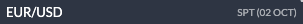
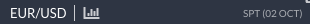
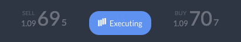
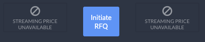
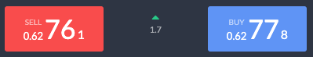
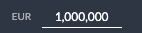
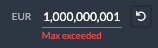
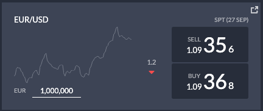
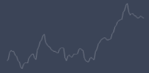

### Spot Tile Component:  

Spot tile files are located in `../apps/MainRoute/widgets/spotTile/`.

Components relevant to the Spot Tile component:

- `./SpotTileContainer.tsx`: shows either the `<Loadable />` component or the `<TileSwitch />` component.

- `./TileSwitch.tsx`: shows the `<Tile />` component and conditionally renders the necessary _tile controls_, see price controls.

- `./components/Tile.tsx`: depending on the view (Normal or Analytics) shows either the `<SpotTile />` component or the `<AnalyticsTile />` component.

- #### **Spot Tile Normal View:**  

    
  File location: `./components/SpotTile.tsx`

  - #### **Spot Tile Header:**

    **Browser**  
      
    **OpenFin**  
      
    File location: `./components/TileHeader.tsx`

    Comments:

    - Depending on the platform RTC is being ran on, this tile header will render a ChartIQ button or a share button. Hence the `{platform.hasFeature('chartIQ')}` and `{platform.hasFeature('share')}` scripts.

  - #### **Price Controls:**

      
    File location: `./components/PriceControls/PriceControls.tsx`

    Components within `<Price Controls />`:

    - **Buy and Sell buttons:** `./components/PriceButton/PriceButton.tsx`
    - **Price movement component:** `./components/PriceMovement.tsx`

    Comments:

    - Price controls have several states depending on the situation: (see `TileSwitch.tsx` component)
      - Normal (shown above):
        - Sell price shown
        - Buy price shown
        - Price change shown
      - _Executing_ a trade (buy/sell):  
        
        - Executing loader shown
        - Sell button disabled
        - Buy button disabled
      - When notional is greater than or equal to 10m:  
        
        - Initiate RFQ button is shown
        - Sell button says _Streaming Price Unavailable_
        - Buy button says _Streaming Price Unavailable_
      - When Initiate RFQ is pressed - and the tile is _awaiting_ for a price:  
        
        - Cancel RFQ button is shown (for a brief second)
        - Awaiting price loader is shown in place of Sell/Buy buttons (for a brief second)
      - When RFQ price has loaded and the 10sec timer begins:  
        
        - RFQ sell price shown (red color fades as timer runs out)
        - RFQ buy price shown (blue color fades as timer runs out)
        - RFQ price change shown
      - When RFQ price becomes stale (expires):  
        
        - Sell button disabled (showing the stale price)
        - Buy button disabled (showing the stale price)
        - Requote button shown

  - #### **Spot Tile Notional Input:**  

      
    File location: `./components/notional/NotionalInput.tsx`

    Comments:

    - Input values greater than or equal to 10,000,000 (10m) causes this component to show the `<ResetInputValue />` button component to show - located in the same file.
    - Input values greater than 1,000,000,000 (1b) causes this component to show the `<MessagePlaceholder />` component - located in the same file.  
      
    - Notional input component has the functionally to receive `${Number}m` as input (i.e. `1m = 1,000,000`, `1k = 1,000`)

- **Spot Tile Analytics View:**  
    
  File location: `./components/analyticsTile/AnalyticsTile.tsx`

  - **Spot Tile Analytics Chart:**  
      
    File location: `./components/analyticsTile/AnalyticsTileChart.tsx`

  - **Price Controls:**  
      
    File location: `./components/analyticsTile/AnalyticsTilePriceControl.tsx`

  - Other components that belong in the `<AnalyticsTile />` like the `<TileHeader />`, `<NotionalInput>` and conditionally rendered _tile controls_ (see comments on price controls above) are all similar to the **Spot Tile Normal View** shown above.
