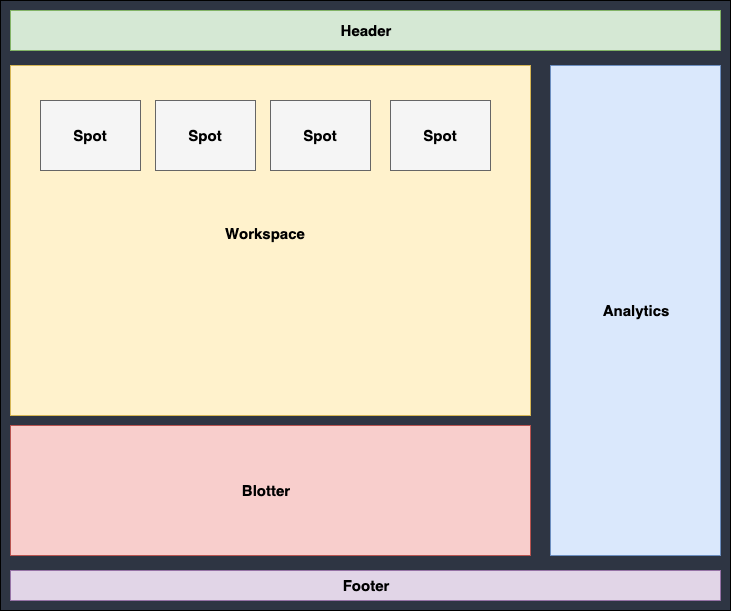
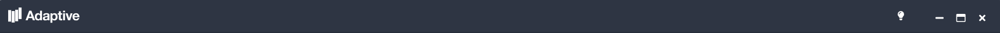
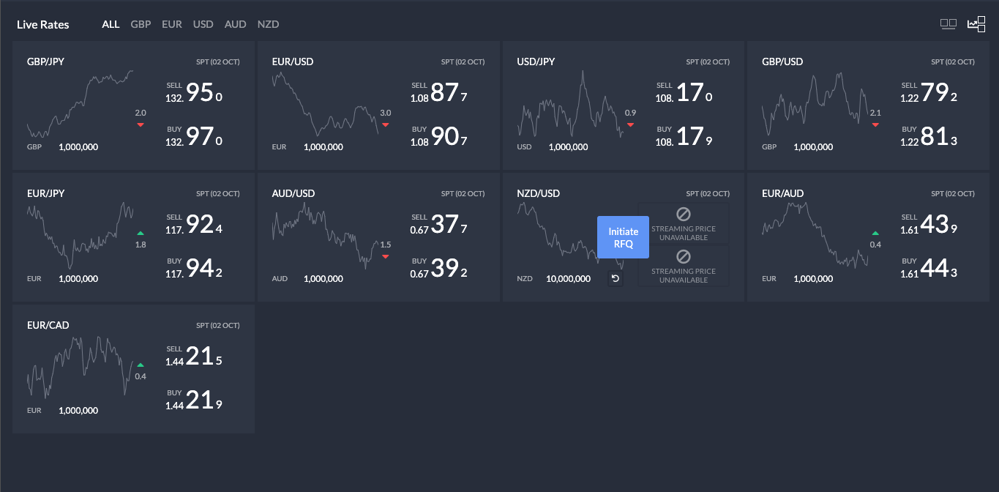
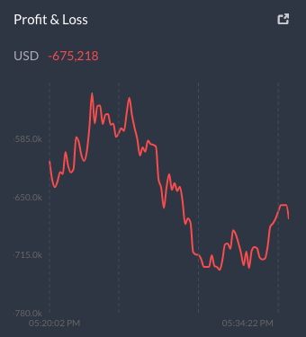
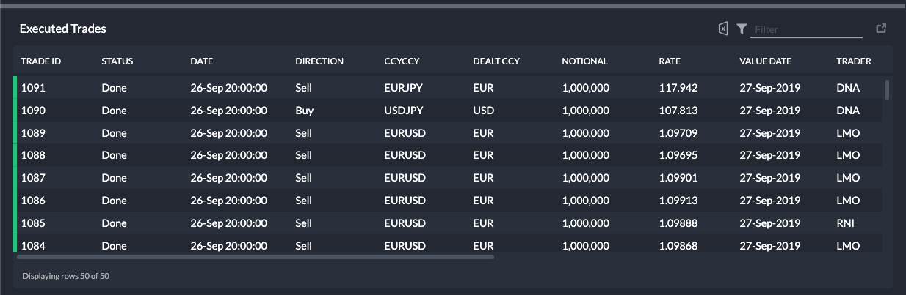
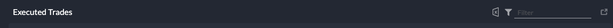
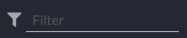

# UI Structure documentation

UI Components can be located in `./src/client/src/`

The app has 5 main routes (can run as a stand-alone) as described in `../apps/MainRoute/Router.tsx`  

- `/` - main application
- `/analytics` - analytics section
- `/blotter` - blotter section
- `/tiles` - workspace section, where all the spot tiles live.
- `/spot/:symbol` - a single spot tile (i.e. `/spot/eurusd`, `/spot/usdjpy`)

The main application can be broken down into 6 main sections:  
  

- [**Header**](#header) section has the Adaptive logo and toggle theme button and in different platforms (OpenFin) also comes with window controls such as `minimize`, `maximize`, and `close`.
- [**Workspace**](#workspace) section houses all the spot tile currency pairs (EUR/USD, GBP/USD, USD/JPY, etc.). This section can be viewed in two ways, _'normal'_ and _'analytics'_.
- [**Spot**](./SpotTile-docs.md) - a single currency pair tile. This is where all trade execution happens.
- [**Analytics**](#analytics) section showcases the `Profit & Loss`, `Positions`, and `PnL` graphs in different forms.
- [**Blotter**](#blotter) section shows a table of all the executed trades.
- [**Footer**](#footer) section has a status button that toggles a service list pop-up showing the connection status of each services and the number of connected instances open.

### Header

**Browser**
  
**OpenFin**
  
File location: `../apps/MainRoute/components/app-header/Header.tsx`

- The Adaptive logo `<Logo />` and theme control button `<ThemeControl />` components can be found in the same file.
- Take note that the `children` props being rendered here are **only for** OpenFin env; these _children_ will be the `minimize`, `maximize` and `close` buttons.

### Workspace

_**Normal** View_  
  
_**Analytics** View_  
  
File location: `../apps/MainRoute/widgets/workspace/Workspace.tsx`

- #### Workspace Header

    

  - Navigation items `ALL`, `EUR`, `USD`, `GBP`, `AUD`, and `NZD` can be found on the same file, written as `<NavItem />` components - which are dynamically loaded. It is also segregated by a `<LeftNav>` _styled_ component.

  - Tile view buttons (Normal view & Analytics view) are also found on the same file, written as `<NavItem />` components - segregated by a `<RightNav>` _styled_ component.

- #### [Spot Tile](./SpotTile-docs.md)

### Analytics

Analytics files are located in `../apps/MainRoute/widgets/analytics`.

  
File location: `../apps/MainRoute/widgets/analytics/components/Analytics.tsx`

- Chart

- #### Proft and Loss line chart

    
  File location: `./components/ProfitAndLoss.tsx`

- #### Positions bubble chart

    
  File location: `./components/Positions.tsx`

- #### PnL bar chart
    
  File location: `./components/PnL.tsx`

### Blotter

Blotter files are located in `../apps/MainRoute/widgets/blotter/`.

  
File location: `./components/Blotter.tsx`

- #### Blotter Header

    
  File location: `./components/BlotterHeader.tsx`

  - Components within the blotter header:

    - `<ExcelButton />`:  
        
      File location: `./components/toolbar/ExcelButton.tsx`

    - `<BlotterToolbar />`:  
        
      File location: `./components/toolbar/BlotterToolbar.tsx`

    - Popout Button:  
      
      - reusable component located in `rt-components` folder.

- #### Blotter Table

  

  - The blotter table/grid used here comes from a library called [_ag-Grid_](https://www.ag-grid.com/).
  - All of its column definitions and configurations are located in the `./components/blotterUtils.ts` file.

- #### Blotter Status

  

  - the blotter status displays the number of rows shown on the table with or without filters.

### Footer

File location: `../apps/MainRoute/widgets/status-connection/StatusButton.tsx`

- The footer only consists of the `<StatusButton />` component that toggles a modal that shows the connection status of the services and the number of nodes open for that instance.
- Looking at `<ShellRoute />` located in `..apps/MainRoute/routes/ShellRoute.tsx`, it can be seen being passed as a prop to `footer={....}`.

- #### Service List Popup (modal)

  

  - this service list shows different `<Service />` components located in `../apps/MainRoute/widgets/status-connection/Service.tsx`
